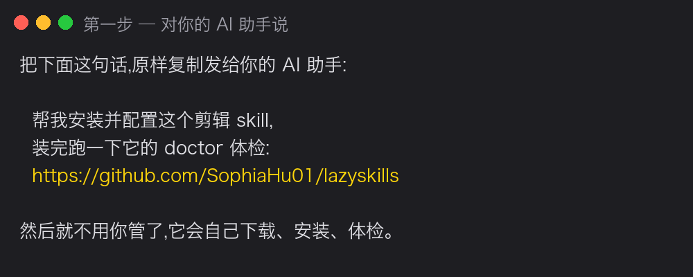

English | [简体中文](tutorial.zh-CN.md)

# Absolute-Beginner Tutorial: lazycut in three sentences

> You need: a computer (Mac smoothest, Windows works); an **AI coding assistant**
> (Claude Code or Cursor — install one from its website if you don't have it); and
> **whatever video editor you already use**. Free; nothing leaves your machine.

## Step 1 — Send this one sentence to your AI (that's the whole install)



Copy-paste verbatim:

> Install and set up this video-editing skill for me, then run its doctor check:
> https://github.com/SophiaHu01/lazyskills

Then hands off: it downloads, installs what's missing, and runs the health check.
The report looks like this — all green, or green with a few yellows, means go:


<details>
<summary>Prefer to install by hand? (optional)</summary>

```bash
git clone https://github.com/SophiaHu01/lazyskills.git
cd lazyskills/lazycut
python3 scripts/doctor.py
```

Or without a terminal: open https://github.com/SophiaHu01/lazyskills → green **Code**
button → **Download ZIP** → unzip → drag the folder to your AI.


</details>

## Step 2 — Start, also one sentence

Put your footage in a folder and say:


First use only, it asks: **which editor you use** (CapCut, JianYing, DaVinci, Premiere —
whatever you already have; output format follows your answer); six style questions; and
if your editor has zero drafts, a 40-second ritual (new draft → drop any clip → one
caption → save) so it can learn your editor's format from your machine.

## Step 3 — Nod at three checkpoints

Before cutting (the polished transcript), before rendering animations (each listed with
its reason), and before sending anything anywhere.

## Step 4 — Collect


Open **your editor**: a new project appears with clips, captions and cards on separate
tracks. Tweak by hand, export as usual. (CapCut screenshots coming; other editors look
much the same.)

## One honest heads-up

This skill **may not work on every machine** — hardware, OS and editor versions vary
wildly. If anything breaks, don't fight it alone: ping me on Xiaohongshu/Douyin
(**八氧化索(AI 版)**, XHS 26872862617 · Douyin 54669229545) or open a GitHub issue with
the error. Every report becomes a fix; early bug-hunters get credited in the README.

## FAQ

**Changed your mind mid-way?** Just say it — "delete sentence 3", "bigger captions".
Only the affected steps re-run.
**Not your taste?** Correct it; corrections go into your local mistake journal.
**Is anything uploaded?** No. Everything runs locally; no account, no server.
**Stuck?** Paste the exact error to your AI — errors are written so an AI can
self-rescue. Still stuck: see the heads-up above.
